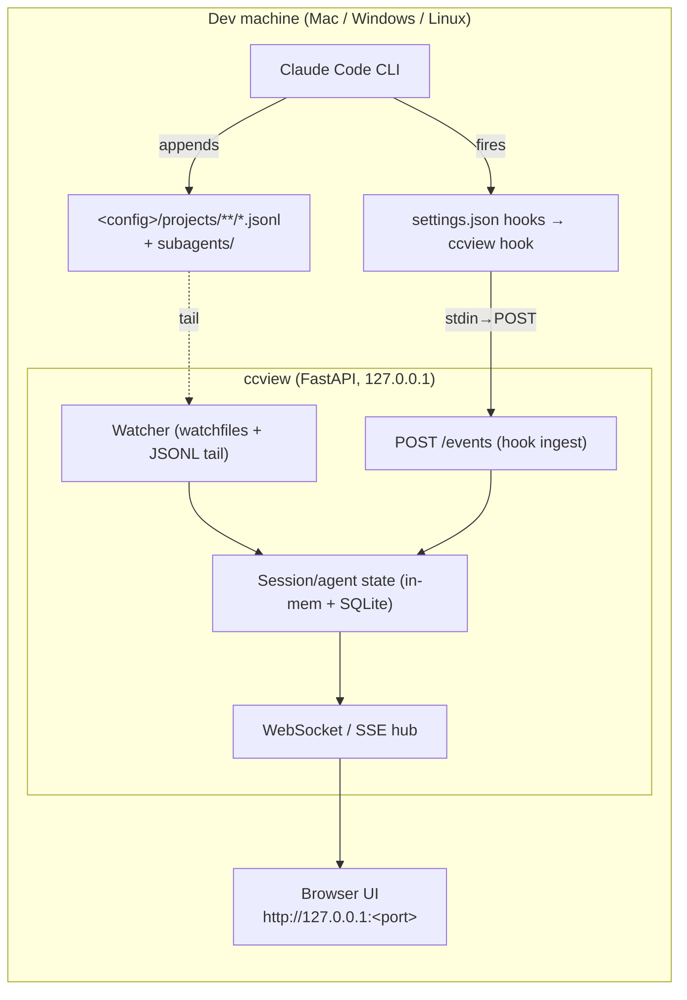

# CCVIEW-SCOPE-001 — Local Live Viewer for Claude Code Subagents

**Status:** Scoping draft (rev. 2 — local-only, cross-platform)
**Working name:** `ccview`
**Goal:** Surface the per-agent activity you currently navigate with arrow keys inside the Claude Code TUI in a standalone local app, so you can watch agents fan out, drill into any one, and step away from the terminal.

**Scope constraints (this revision):**
- **Local to the dev machine only.** No remote hosts, no Traefik, no reverse proxy, no auth layer.
- **Binds `127.0.0.1` only.** Localhost trust boundary; nothing listens on the LAN.
- **Cross-platform: macOS, Windows, Linux** (incl. WSL) as a first-class requirement, not an afterthought.

---

## 1. Core finding (unchanged)

The arrow-key view is not a privileged in-process render. Claude Code persists everything that view shows to disk as it happens:

- Each session is an **append-only JSONL** at `<config>/projects/<encoded-cwd>/<session-id>.jsonl` — one JSON object per line: user prompts, assistant turns (text / `tool_use` / thinking), `tool_result`, per-turn token usage, model, git snapshots, chained by `parentUuid`.
- **Every subagent spawn links to a child transcript** (observed layout: `<session-id>/subagents/…`). The agents you scroll map 1:1 to child transcript files.
- Lifecycle **hooks** (`SubagentStart`, `SubagentStop`, `PreToolUse`, `PostToolUse`, `Stop`, `Notification`, `SessionStart/End`) in `settings.json` are handed JSON on stdin including `session_id`, `transcript_path`, `cwd`, `hook_event_name`.

The app = **tail the JSONL tree (content) + key off hooks (event spine) → push to a local UI.**

---

## 2. Cross-platform design (the part that actually needs care)

### 2.1 Locating the data
- Base config dir: **`CLAUDE_CONFIG_DIR` if set, else `~/.claude`.** `Path.home()` resolves correctly on all three OSes (`%USERPROFILE%` on Windows). Projects live at `<base>/projects/`; a global index is at `<base>/history.jsonl`.
- The `projects/<encoded-cwd>` slug is OS-dependent (Windows encodes the drive + backslashes, e.g. `C--Users-Beast-...`; unix encodes `/Users/...` as `-Users-...`). **Treat it as opaque** — never parse it. Read the real `cwd` from inside the JSONL when you need to label a project.
- **WSL caveat:** Claude Code run *inside* WSL writes to the Linux `~/.claude`; run *native Windows* it writes to `%USERPROFILE%\.claude`. These are two separate installs. Ship a `--claude-dir` override (and honor `CLAUDE_CONFIG_DIR`) so the user can point the viewer at whichever one they actually run.

### 2.2 File watching
- Use **`watchfiles`** (maintained, Rust `notify` under the hood) for a single cross-platform watcher API over FSEvents (macOS) / inotify (Linux) / ReadDirectoryChangesW (Windows).
- **inotify watch limits (Linux):** recursively watching the whole `projects` tree can exhaust `fs.inotify.max_user_watches`. Mitigate by lazily watching only *active* project subtrees — `SessionStart`/`SubagentStart` hooks tell you which `cwd` just went live, so add the watch then. Keep `force_polling` as a fallback mode.
- **New files mid-session:** subagent transcripts are created *during* a run. The watcher must handle CREATE events for new child files/dirs, not just MODIFY on known files.
- **Partial-line tailing:** track a per-file byte offset; on each event seek to offset, read new bytes, split on `\n`, parse only complete lines, buffer the trailing partial. This handles the "JSONL line is mid-write" race uniformly on all OSes.
- **Windows specifics:** open transcripts read-only with shared-read so you don't collide with Claude Code's appends; tolerate event coalescing under churn (the offset re-read covers missed-then-merged events). Decode UTF-8 leniently and strip `\r`.
- **Compaction/rotation:** if a file shrinks below your stored offset (compaction rewrote it), reset and re-read from 0.

### 2.3 Hooks (only the command string differs per OS)
- Ship a tiny subcommand, **`ccview hook`**, that reads the hook JSON from stdin and POSTs it to `http://127.0.0.1:<port>/events`. This puts all logic in one cross-platform binary; only the launcher path differs between OSes, not the behavior.
- Provide **`ccview install-hooks` / `uninstall-hooks`** that idempotently writes the correct `settings.json` block per platform — avoids users hand-editing JSON and tripping over Windows shell quoting.
- **Don't trust `SubagentStop` alone for completion** — hooks may not fire when a run hits `max_turns`. Reconcile with the tail: treat an agent as done when its file stops growing *and* the parent resumes. Hooks are the fast signal; the transcript is the source of truth.
- **Phase-0 must verify hooks actually fire on each OS** (Windows shell invocation is the riskiest path).

### 2.4 Packaging & run (fits your uv-everything setup)
- Distribute via **`uv tool install ccview`** → `ccview` on PATH on all three OSes (`uvx ccview` for ephemeral). No Node required at runtime — bundle the built React SPA inside the wheel and let FastAPI serve it at `/`.
- `ccview` with no args: start server on `127.0.0.1`, auto-pick a free port, `webbrowser.open(...)`. **Bind loopback explicitly — never `0.0.0.0`.**
- **Not Docker.** A container would have to bind-mount the host `~/.claude` and receive its file events; that's painful and unreliable cross-platform (Windows path translation, Docker Desktop inotify propagation). For a host-file-watching local tool, a native process is the correct call — a deliberate departure from the earlier Docker/Traefik framing.

---

## 3. Architecture (single host, localhost)



Tail gives content; hooks tell the tailer *where to look* and light up the UI the instant an agent appears. Either alone is lossy; together you get an accurate live tree with minimal guesswork.

---

## 4. Data model (minimum viable)

```
Session  { id, cwd, project, model, started_at, status, root_session_id }
Agent    { id(=child session id), parent_session_id, type, color,
           status: running|done|error, started_at, ended_at }
Event    { id, agent_id, ts, kind: text|tool_use|tool_result|thinking|usage|notify,
           tool_name?, summary, tokens_in?, tokens_out?, raw_ref }
```

- `Agent.type`/`color` come from subagent frontmatter / the `SubagentStart` matcher — same labelled lanes the CLI shows.
- Store `raw_ref` (file + offset), not duplicated payloads; lazy-load detail on click. Keeps the store light and avoids holding transcript content (and any secrets in it) in a second place.
- SQLite is plenty for a single-user local tool; the live view is really in-memory state fed by the stream.

---

## 5. Form factor — recommend the localhost web app

- **A. Localhost web app (recommended MVP).** FastAPI serves a React SPA on `127.0.0.1`; `ccview` auto-opens the browser. One codebase, zero per-OS build, runs anywhere `uv` runs. A live "agent lane" layout (one card/column per running subagent, click to expand its transcript) reproduces the arrow-key experience without arrow keys.
- **B. Tauri desktop app (Phase 2 upgrade).** Native window + system tray/menu-bar + single binary per OS; can simply load `http://127.0.0.1:<port>` or embed the webview. Cost: Rust toolchain and a build/sign step per OS (your AD CS / code-signing experience transfers, but it's 3 targets). Worth it only if you want an always-on tray HUD.
- **C. TUI (Phase-0 spike + lightweight mode).** `textual` runs in any terminal incl. Windows Terminal/PowerShell. Fast to ship; good for validating the parser and as a minimal mode, though it's still terminal-bound.

Path: **C as a 1-day spike to validate parsing + subagent linking on each OS, then A as the product;** C-as-mode and B only if you want them.

---

## 6. MVP scope (phased)

**Phase 0 — Spike (½–1 day, run on all three OSes).** Resolve config dir (incl. `CLAUDE_CONFIG_DIR`), tail one project's JSONL, parse the line variants, print the parent→child agent tree. **Confirm the subagent file layout and that hooks fire** on Mac, Windows, Linux at your current CC version. De-risks everything.

**Phase 1 — Live localhost web view (MVP).**
- Watcher (watchfiles, lazy per-active-project) + JSONL parser → in-memory tree.
- `ccview hook` + `install-hooks` writing per-OS `settings.json`.
- WebSocket push → React "agent lanes": live status, current tool, last text, token counter; click to expand full transcript.
- `ccview` launches on `127.0.0.1`, auto-opens browser. `uv tool install` packaging with bundled SPA.

**Phase 2 — History + search.** Persist sessions; browse past runs (own index over the JSONL tree, or the Agent SDK's `list_sessions`/`get_session_messages`). Feeds your after-action-review habit.

**Phase 3 — Polish.** Optional Tauri shell (tray/menu-bar, notifications); optional TUI mode sharing the same backend.

**Phase 4 (optional) — Control.** Pause/approve via `PreToolUse`/`PermissionRequest` hooks. Scope creep — gate behind real need; viewer-only otherwise.

---

## 7. Build vs. buy / prior art

- **AgentsRoom** — commercial multi-agent dashboard surfacing CC hooks live; closest "buy," but cloud/fleet-oriented, not a local single-machine tool.
- **claude-code-otel** — OTel + Prometheus + Loki + Grafana; that's the cost/perf half, not live content.
- **claude-devtools / simonw's claude-code-transcripts** — transcript parsers/viewers, historical not live.
- Various `session-reader` MCP impls confirm the `subagents/` layout.

**The gap worth building:** a *live, labelled, per-subagent content view* mirroring the arrow-key experience, running entirely locally on Mac/Win/Linux. None of the above nails exactly that.

---

## 8. Security (local trust boundary — much simpler now)

- No network exposure and no auth needed for a single-user dev box — **provided you bind `127.0.0.1`, not `0.0.0.0`.** That one line is the whole boundary; get it right.
- Transcripts are **plaintext, unencrypted at rest**; if a tool reads a `.env` or echoes a credential it lands in the JSONL. Your service streams that in-memory on localhost — acceptable locally, but **persist `raw_ref`s, not raw content**, and optionally redact known secret patterns at parse time.
- **Optional hardening** (skip for a personal box): a loopback-only token on the API/WebSocket so other local users/processes on a shared machine can't read the stream.
- Relevant CC knobs to degrade gracefully around: `cleanupPeriodDays`, `CLAUDE_CODE_SKIP_PROMPT_HISTORY`, `claude project purge`.

---

## 9. Fit with your existing stack (scope-tightening)

- **Orchid's PM Dashboard** already visualizes *Orchid's* agents live. `ccview` is the equivalent for *Claude Code's native* subagents. Share the front-end "agent lane" component between them — one viewer, two feeds.
- **tokenscape** already owns token/cost. `ccview` should *show* those numbers (or read its data), not recompute them.

Net unique surface area: **the live transcript-tree viewer + the hook event spine, cross-platform and local.** Build that; reuse the rest.

---

## 10. Open decisions (your call)

1. **MVP front end:** localhost web app (A) vs. start-with-TUI spike (C). Recommend C spike → A product.
2. **Persistence in MVP, or live-only first?** Recommend live-only in Phase 1, add history in Phase 2.
3. **Tauri shell — ever, or never?** Decide whether a native tray app is a real want before paying the per-OS build cost.

If you green-light the recommended path (A, viewer-only, `uv`-packaged), next deliverable is the Phase-0/Phase-1 build plan: the cross-platform config-dir resolver + JSONL parser with line-variant types, the `ccview hook` / `install-hooks` commands with per-OS `settings.json` blocks, and the FastAPI + React skeleton.
